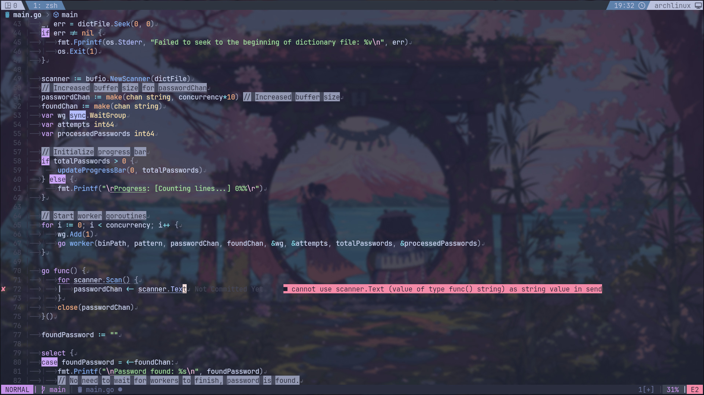

# neovim

<p align="center">
  <a href="https://skillicons.dev">
    
  </a>
</p>

My minimal Neovim configuration provides good experience for multiple languages and facilitates DevOps-related tasks  ^‿^

My config based on [Iogamaster/Neovim](https://github.com/IogaMaster/neovim)

## Screenshot


## Installation

Paste in the terminal to install:
```
git clone https://github.com/qrxnz/neovim.git --depth=1 ~/.config/nvim/ && nvim
```
