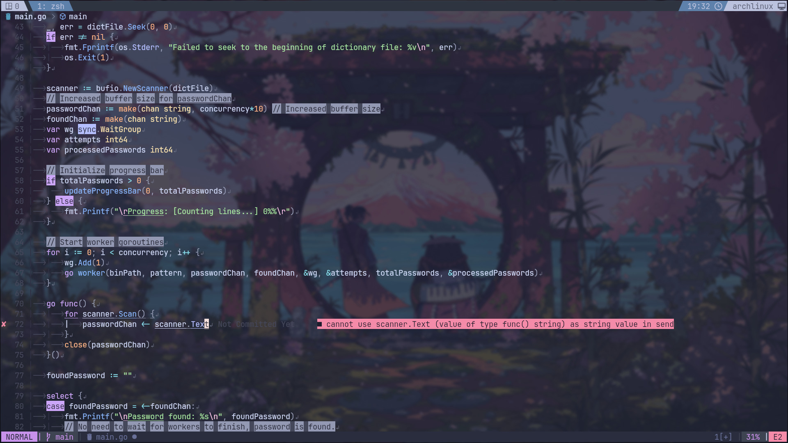

# nveem

> Neovim configuration buit with nixvim

My minimal Neovim configuration provides good experience for multiple languages and facilitates DevOps-related tasks `^‿^`



## ⚒️ Installation

- **Run without installing**

```bash
nix run github:qrxnz/nveem
```

- **Add to a Nix Flake**

Add input in your flake like:

```nix
{
 inputs = {
   nveem = {
     url = "github:qrxnz/nveem";
     inputs.nixpkgs.follows = "nixpkgs";
   };
 };
}
```

With the input added you can reference it directly:

```nix
{ inputs, system, ... }:
{
  # NixOS
  environment.systemPackages = [ inputs.nveem.packages.${pkgs.system}.default ];
  # home-manager
  home.packages = [ inputs.nveem.packages.${pkgs.system}.default ];
}
```

- **Install imperatively**

```bash
nix profile install github:qrxnz/nveem
```

## 🗒️ Credits

### 🎨 Inspiration

I was inspired by:

- [IogaMaster](https://github.com/IogaMaster/neovim)
- [redyf](https://github.com/redyf/Moon)
- [elythh](https://github.com/elythh/nixvim)
- [pete3n](https://github.com/pete3n/nixvim-flake/tree/main)
